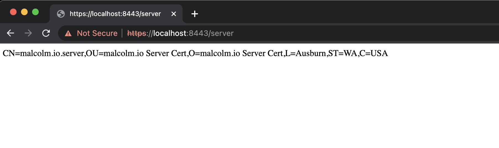
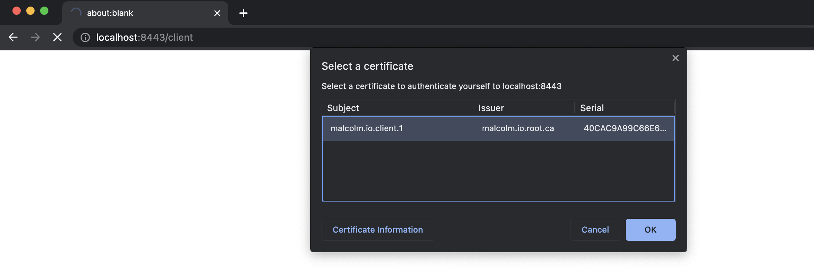
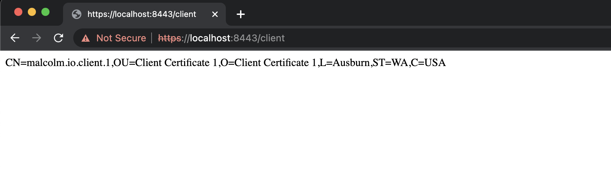
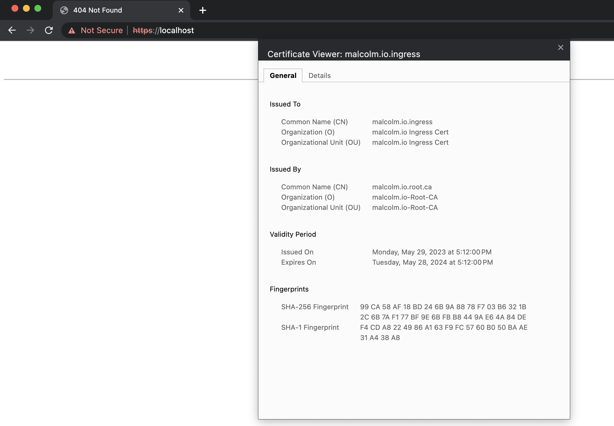
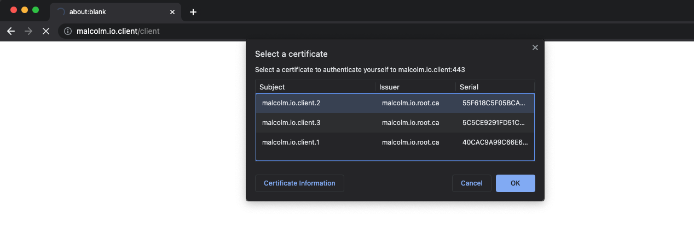
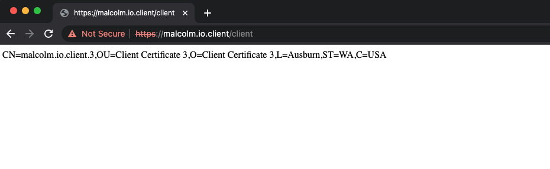
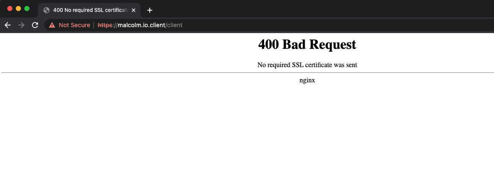
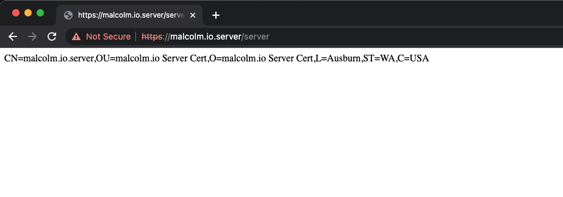
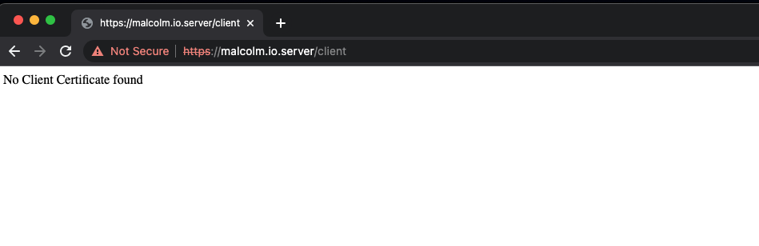

# Mutual TLS with Ingress-Nginx Controller

## TLDR;

Simple walk through to get up and running with M-TLS; Mutual TLS - client certificate validation with Ingress-Nginx controller in a local Kubernetes cluster like DockerDesktop.

Show me the code.

https://github.com/MalcolmPereira/clientcert

## Sample Application

The sample application is a simple SpringBoot echo application that is accessed using a client certificate, echoing back subject associated with client certificate. This is then deployed on a local Kubernetes cluster with Ingress-Nginx controller configured for Mutual TLS.

Mutual TLS, is a two-way TLS authentication mechanism where both client and server are authenticated using certificates. The client certificate is validated by server and server certificate is validated by client. This is different from the traditional TLS where only server is authenticated using a certificate.


## Generate TLS Material

We will use [CloudFlare CFSSL](https://cfssl.org) to generate trust material. CloudFlare cfssl can be easily installed on all operating systems or built from source.

Confirm cfssl version before running commands.

```bash
cfssl version

Version: 1.6.1
Runtime: go1.17
```

**NOTE!!!!:**

We are genrating are storing TLS artifacts in a source code repo, you will never do this in a real production setup, since this is just a simple walkthrough and trust material is throw away with no real usage or implications, I am proceeding this route. Please do not commit TLS keys or secrets in production set up.

### 1. Generate Root CA TLS material

Generate ca using cfssl, CA certificate definitions are in the tls/ca/malcolm_io_ca.json file. We generate CA certificate and then use that to sign server certificate and client certificates.

```bash
cfssl gencert -initca tls/ca/malcolm_io_ca.json | cfssljson -bare tls/ca/malcolm_io_ca

2023/05/28 17:08:47 [INFO] generating a new CA key and certificate from CSR
2023/05/28 17:08:47 [INFO] generate received request
2023/05/28 17:08:47 [INFO] received CSR
2023/05/28 17:08:47 [INFO] generating key: rsa-4096
2023/05/28 17:08:48 [INFO] encoded CSR
2023/05/28 17:08:48 [INFO] signed certificate with serial number 624223140328914857446330038995721436860516190018
```

Convert PEM to certificate which we can import in a custom trust store later.

```bash
openssl x509 -in tls/ca/malcolm_io_ca.pem -out tls/ca/malcolm_io_ca.crt -outform der
```


### 2. Generate CA Signed Server Certificate

Definitions for server certificate in tls/server/malcolm_io_sever.json file, profile.json contains tls signing profiles.

```bash
cfssl gencert -ca tls/ca/malcolm_io_ca.pem -ca-key tls/ca/malcolm_io_ca-key.pem -config tls/profile.json -profile=server tls/server/malcolm_io_sever.json | cfssljson -bare tls/server/malcolm_io_sever

2023/05/28 17:12:02 [INFO] generate received request
2023/05/28 17:12:02 [INFO] received CSR
2023/05/28 17:12:02 [INFO] generating key: rsa-4096
2023/05/28 17:12:02 [INFO] encoded CSR
2023/05/28 17:12:02 [INFO] signed certificate with serial number 307811460485197263130452639905424636572172501266
```

Convert PEM to certificate to PKCS12 format, use legacy flag to support breaking changes on macos ventura and above as of 05/29/2023.

```bash
openssl x509 -in tls/server/malcolm_io_sever.pem -out tls/server/malcolm_io_sever.crt -outform der

openssl pkcs12 -export -legacy -out tls/server/malcolm_io_sever.pfx -inkey tls/server/malcolm_io_sever-key.pem -in tls/server/malcolm_io_sever.pem -certfile tls/server/malcolm_io_sever.crt

Enter Export Password:
Verifying - Enter Export Password:

Password used is MalcolmIO
```

We also want to include a valid trust store for our application and can use cacerts that comes with JDK which is under JAVA_HOME/lib/security. We will use cacerts from JDK to create a trust store for our application.

Copy cacerts from JDK to the tls/server directory and execute the following to change default truststore password "changeit" for trust store to "MalcolmIO"


```bash
keytool -storepasswd -keystore tls/server/cacerts

Enter keystore password:
New keystore password:
Re-enter new keystore password:

Password used is MalcolmIO
```

We now want to import root ca certificate into trust store.

```bash
keytool -import -trustcacerts -alias MalcolmIORootCA -file tls/ca/malcolm_io_ca.crt -keystore tls/server/cacerts -storepass MalcolmIO

....
....
Trust this certificate? [no]:  yes
Certificate was added to keystore
```


### 3. Generate CA Signed Client Certificates

Definitions for client certificate in tls/client/client_cert_1/malcolm.io.client_1.json, tls/client/client_cert_2/malcolm.io.client_2.json, and tls/client/client_cert_3/malcolm.io.client_3.json.

Profile.json contains tls signing profiles we will use client profile to sign client certificates.

```bash
cfssl gencert -ca tls/ca/malcolm_io_ca.pem -ca-key tls/ca/malcolm_io_ca-key.pem -config tls/profile.json -profile=client tls/client/client_cert_1/malcolm.io.client_1.json | cfssljson -bare tls/client/client_cert_1/malcolm.io.client_1

2023/05/28 17:14:28 [INFO] generate received request
2023/05/28 17:14:28 [INFO] received CSR
2023/05/28 17:14:28 [INFO] generating key: rsa-4096
2023/05/28 17:14:30 [INFO] encoded CSR
2023/05/28 17:14:30 [INFO] signed certificate with serial number 263370288378858811557447337505818292570861833150
```

Convert PEM to certificate to PKCS12 format, the legacy flag is to support breaking changes on macos ventura and above

```bash
openssl x509 -in tls/client/client_cert_1/malcolm.io.client_1.pem -out tls/client/client_cert_1/malcolm.io.client_1.crt -outform der

openssl pkcs12 -export -legacy -out tls/client/client_cert_1/malcolm.io.client_1.pfx -inkey tls/client/client_cert_1/malcolm.io.client_1-key.pem -in tls/client/client_cert_1/malcolm.io.client_1.pem -certfile tls/client/client_cert_1/malcolm.io.client_1.crt

Enter Export Password:
Verifying - Enter Export Password:

Password used is MalcolmIO
```

Similarly generate client certificate for client_cert_2 and client_cert_3.

```bash

cfssl gencert -ca tls/ca/malcolm_io_ca.pem -ca-key tls/ca/malcolm_io_ca-key.pem -config tls/profile.json -profile=client tls/client/client_cert_2/malcolm.io.client_2.json | cfssljson -bare tls/client/client_cert_2/malcolm.io.client_2

2023/05/28 17:15:47 [INFO] generate received request
2023/05/28 17:15:47 [INFO] received CSR
2023/05/28 17:15:47 [INFO] generating key: rsa-4096
2023/05/28 17:15:48 [INFO] encoded CSR
2023/05/28 17:15:48 [INFO] signed certificate with serial number 424542369155348864657710916173222138684262639952


openssl x509 -in tls/client/client_cert_2/malcolm.io.client_2.pem -out tls/client/client_cert_2/malcolm.io.client_2.crt -outform der

openssl pkcs12 -export -legacy -out tls/client/client_cert_2/malcolm.io.client_2.pfx -inkey tls/client/client_cert_2/malcolm.io.client_2-key.pem -in tls/client/client_cert_2/malcolm.io.client_2.pem -certfile tls/client/client_cert_2/malcolm.io.client_2.crt

Enter Export Password:
Verifying - Enter Export Password:

Password used is MalcolmIO
```

```bash
cfssl gencert -ca tls/ca/malcolm_io_ca.pem -ca-key tls/ca/malcolm_io_ca-key.pem -config tls/profile.json -profile=client tls/client/client_cert_3/malcolm.io.client_3.json | cfssljson -bare tls/client/client_cert_3/malcolm.io.client_3

2023/05/28 17:16:29 [INFO] generate received request
2023/05/28 17:16:29 [INFO] received CSR
2023/05/28 17:16:29 [INFO] generating key: rsa-4096
2023/05/28 17:16:30 [INFO] encoded CSR
2023/05/28 17:16:31 [INFO] signed certificate with serial number 94329262698602084257749383602670123427873060358

openssl x509 -in tls/client/client_cert_3/malcolm.io.client_3.pem -out tls/client/client_cert_3/malcolm.io.client_3.crt -outform der

openssl pkcs12 -export -legacy -out tls/client/client_cert_3/malcolm.io.client_3.pfx -inkey tls/client/client_cert_3/malcolm.io.client_3-key.pem -in tls/client/client_cert_3/malcolm.io.client_3.pem -certfile tls/client/client_cert_3/malcolm.io.client_3.crt

Enter Export Password:
Verifying - Enter Export Password:

Password used is MalcolmIO
```

### 4. Generate CA Signed Ingress Certificate

We want to override the default Ingress-Nginx fake TLS certificate with one that we generate.

Definitions for tls certificate in tls/ingress/malcolm_io_ingress.json, profile.json contains tls signing profiles.

```bash
cfssl gencert -ca tls/ca/malcolm_io_ca.pem -ca-key tls/ca/malcolm_io_ca-key.pem -config tls/profile.json -profile=server tls/ingress/malcolm_io_ingress.json | cfssljson -bare tls/ingress/malcolm_io_ingress

2023/05/28 20:05:58 [INFO] generate received request
2023/05/28 20:05:58 [INFO] received CSR
2023/05/28 20:05:58 [INFO] generating key: rsa-4096
2023/05/28 20:05:59 [INFO] encoded CSR
2023/05/28 20:05:59 [INFO] signed certificate with serial number 478058553914932456011571920989055938593421231890
```

Convert PEM to certificate to PKCS12 format, use legacy flag to support breaking changes on macos ventura and above

```bash
openssl x509 -in tls/ingress/malcolm_io_ingress.pem -out tls/ingress/malcolm_io_ingress.crt -outform der

openssl pkcs12 -export -legacy  -out tls/ingress/malcolm_io_ingress.pfx -inkey tls/ingress/malcolm_io_ingress-key.pem -in tls/ingress/malcolm_io_ingress.pem -certfile tls/ingress/malcolm_io_ingress.crt

Enter Export Password:
Verifying - Enter Export Password:

Password used is MalcolmIO
```

Now that we have all TLS material in place we can proceed by first integrating server side certificates to the spring boot application. Once we have validated desired behavior we can proceed Kubernetes deployment and Ingress-Nginx.


## Server Application

The server application is a simple Spring Boot Application.

Copy tls/server/cacerts file, tls/server/malcolm_io_sever.pfx, tls/server/malcolm_io_sever.crt to the server application resources folder.

```bash
cp tls/server/cacerts src/main/resources/
cp tls/server/malcolm_io_sever.pfx src/main/resources/
cp tls/server/malcolm_io_sever.crt src/main/resources/
```

We could use pem keys for application as well, but we will just use pfx file.

Update application properties for server TLS configuration.

```bash
server.port=${SERVERPORT:8443}
server.ssl.protocol=TLS
server.ssl.enabled-protocols=TLSv1.2,TLSv1.3
server.ssl.trust-store-type=${TRUSTSTORETYPE:JKS}
server.ssl.trust-store=${TRUSTSTORE:classpath:cacerts}
server.ssl.trust-store-password=${TRUSTSTORECRED:MalcolmIO}
server.ssl.key-store-type=${KEYSTORETYPE:PKCS12}
server.ssl.key-store=${KEYSTORE:classpath:malcolm_io_sever.pfx}
server.ssl.key-store-password=${KEYSTORECRED:MalcolmIO}
server.ssl.client-auth=want
```

The important setting here is server.ssl.client-auth=want i.e. if a client certificate is provided in the request we will use it else return no client certificate available, had we set this to "need" instead of "want" the server would have rejected the request if no client certificate was available.

Also note that in a production setup, credentials will come from some secret environment variable.

Start up the application.

```bash
mvn spring-boot:run

....
....
2023-05-29 14:54:41.260  INFO 1376 --- [  restartedMain] o.s.b.web.embedded.jetty.JettyWebServer  : Jetty started on port(s) 8443 (ssl, http/1.1) with context path '/'
2023-05-29 14:54:41.265  INFO 1376 --- [  restartedMain] c.m.s.clientcert.ClientCertApplication   : Started ClientCertApplication in 0.963 seconds (JVM running for 1.109)
```

Validate [Server Details](https://localhost:8443/server) 



Access [Client Details](https://localhost:8443/client) without any client certificate which returns No Client Certificate found as expected.


Add client certificate to the browser;

Example for Chrome, go to settings -> Manage Certificates -> Import, on MAC OS use Keychain Access to import the client certificates, on windows certificate snap in can be used.

Access [Client Details](https://localhost:8443/client) with client certificate in place , this will prompt for the client certificate to be used.



Select client certificate and click OK, we should now see subject for associated client certificate as output.



Java code just parses available client certificate and returns the subject name.

```
   private static final String SSL_CLIENT_CERT_ATTRIBUTE = "javax.servlet.request.X509Certificate";

   ...
   X509Certificate[] certs = (X509Certificate[]) this.context.getAttribute(SSL_CLIENT_CERT_ATTRIBUTE);
   LOGGER.info("Client Certificate from Request Attribute : {} {}", SSL_CLIENT_CERT_ATTRIBUTE, certs);
   if(certs == null || certs.length == 0){
      LOGGER.error("No Client Certificate found");
      return "No Client Certificate found";
   }
   return certs[0].getSubjectX500Principal().getName();
   ...
```

Now that application functionality has been validated locally, lets make a docker image and validate in a local Kubernetes Cluster. The pom file includes google jib plugin to build the docker image.

```bash
mvn clean package
```

Validate that the docker image is created and push to dockerhub

```bash
docker images | grep malcolm
malcolmpereira/clientcert 1.0.0  0f413c1198da   2 minutes ago   482MB

docker push malcolmpereira/clientcert:1.0.0

The push refers to repository [docker.io/malcolmpereira/clientcert]
6684ecd9a315: Pushed
a9c4a6e8ecbd: Pushed
37931a967cd0: Pushed
e38e29fe8210: Pushed
bc45d2593239: Pushed
8e5f6d41b5a8: Pushed
1.0.0: digest: sha256:3441307fd5416994771480a6bd0a8119c9b9303fd790bddf8bda3af12f968d1c size: 1579
```

*Note:*
The pom file generates both ARM64 for Apple Silicon and AMD64 images, please uncomment the pom for specific architecture, default is AMD64.

```xml
<from>
    <image>${base.image}</image>
    <platforms>
    <platform>
        <architecture>amd64</architecture>
        <os>linux</os>
    </platform>
    <!--
    <platform>
        <architecture>arm64</architecture>
        <os>linux</os>
    </platform>
    -->
</platforms>
</from>
```

## Kubernetes Cluster Configuration

Start up a local Kubernetes Cluster using Docker Desktop

We will first install application without any Ingress Controller and access service by port forwarding, we could use NodePort, but since we will use Ingress Controller later, lets just port forward for now.

Create a new namespace for the application and install the application

```bash
kubectl config use-context docker-desktop

kubectl create namespace malcolmio

kubectl apply -f malcolm_io_server.yaml --namespace=malcolmio

kubectl get pods --namespace malcolmio
NAME                          READY   STATUS    RESTARTS   AGE
clientcert-64ffb5fc4c-m58bf   1/1     Running   0          2m22s

kubectl get services --namespace malcolmio
NAME         TYPE        CLUSTER-IP      EXTERNAL-IP   PORT(S)    AGE
clientcert   ClusterIP   10.109.35.251   <none>        8443/TCP   2m53s

kubectl port-forward service/clientcert --namespace malcolmio 8443:8443

Forwarding from 127.0.0.1:8443 -> 8443
Forwarding from [::1]:8443 -> 8443
```

This should prompt for client certificate and return client details as before only different service is now running in Kubernetes.


## Ingress-Nginx Controller

Before we install the NGINX Ingress Controller, we will create a Kubernetes Secret for client certificate we created specifically for Ingress-Nginx Controller.

```bash
kubectl create secret tls malcolmio-ingress-tls --key tls/ingress/malcolm_io_ingress-key.pem --cert tls/ingress/malcolm_io_ingress.pem --namespace malcolmio

secret/malcolmio-ingress-tls created
```

Now we can install the Ingress-Nginx Controller using [HELM](https://helm.sh) as documented in [Inginx Ingress Quick Start](https://kubernetes.github.io/ingress-nginx/deploy/#quick-start )

Please note since we are installing via helm we need to set **--set controller.extraArgs.default-ssl-certificate="malcolmio/malcolmio-ingress-tls"** to use client certificate secret we created earlier.

```bash
helm repo add ingress-nginx https://kubernetes.github.io/ingress-nginx

helm repo update ingress-nginx

helm upgrade --install --namespace ingress-nginx --create-namespace --set controller.extraArgs.default-ssl-certificate="malcolmio/malcolmio-ingress-tls" --version 4.6.1 ingress-nginx ingress-nginx/ingress-nginx

Release "ingress-nginx" does not exist. Installing it now.
NAME: ingress-nginx
LAST DEPLOYED: Sun May 28 20:24:12 2023
NAMESPACE: ingress-nginx
STATUS: deployed
REVISION: 1
TEST SUITE: None
NOTES:
The ingress-nginx controller has been installed.
It may take a few minutes for the LoadBalancer IP to be available.
You can watch the status by running 'kubectl --namespace ingress-nginx get services -o wide -w ingress-nginx-controller'

An example Ingress that makes use of the controller:
  apiVersion: networking.k8s.io/v1
  kind: Ingress
  metadata:
    name: example
    namespace: foo
  spec:
    ingressClassName: nginx
    rules:
      - host: www.example.com
        http:
          paths:
            - pathType: Prefix
              backend:
                service:
                  name: exampleService
                  port:
                    number: 80
              path: /
    # This section is only required if TLS is to be enabled for the Ingress
    tls:
      - hosts:
        - www.example.com
        secretName: example-tls

If TLS is enabled for the Ingress, a Secret containing the certificate and key must also be provided:

  apiVersion: v1
  kind: Secret
  metadata:
    name: example-tls
    namespace: foo
  data:
    tls.crt: <base64 encoded cert>
    tls.key: <base64 encoded key>
  type: kubernetes.io/tls
```

```bash

kubectl --namespace ingress-nginx get services -o wide -w ingress-nginx-controller

NAME                       TYPE           CLUSTER-IP     EXTERNAL-IP   PORT(S)                      AGE   SELECTOR
ingress-nginx-controller   LoadBalancer   10.102.21.75   localhost     80:30834/TCP,443:30165/TCP   54s   app.kubernetes.io/component=controller,app.kubernetes.io/instance=ingress-nginx,app.kubernetes.io/name=ingress-nginx
```
*Note:*

EXTERNAL-IP is localhost, this is because we are running in Docker Desktop, if you are running in a cloud provider, this will be the external IP of the LoadBalancer.

On Windows EXTERNAL-IP may not be provisioned in which case you will need to use port-forwarding to access the ingress service as documented in [local testing](https://kubernetes.github.io/ingress-nginx/deploy/#quick-start) section of the documentation.

Access [localhost](https://localhost), 404 error code is valid since we haven't created any ingress rules yet.


Now confirm certificate is ingress certificate we created.




## Configure Ingress for Mutual TLS

We will first create secret for the Root CA certificate and the Server Certificate this we will then use in the ingress rule.

First the secret for the CA certificate. The important piece here is the value "ca.crt" this has to be ca.crt and the value needs to be in PEM format.

```bash
kubectl create secret generic malcolmio-ca-tls --from-file=ca.crt=tls/ca/malcolm_io_ca.pem --namespace malcolmio
```

Next the secret for the server certificate. The important piece here is the value "tls.crt" and "tls.key" this has to be tls.crt and tls.key with values in PEM format.

```bash
kubectl create secret generic malcolmio-server-tls --from-file=tls.crt=tls/server/malcolm_io_sever.pem --from-file=tls.key=tls/server/malcolm_io_sever-key.pem --namespace malcolmio
```

Now with the TLS secrets in place lets look at the ingress that mandates use of client certificates and passes the client certificate to backend server.

```yaml
piVersion: networking.k8s.io/v1
kind: Ingress
metadata:
  annotations:
    nginx.ingress.kubernetes.io/auth-tls-secret: "malcolmio/malcolmio-ca-tls"
    nginx.ingress.kubernetes.io/auth-tls-verify-client: "on"
    nginx.ingress.kubernetes.io/auth-tls-verify-depth: "1"
    nginx.ingress.kubernetes.io/auth-tls-pass-certificate-to-upstream: "true"
    nginx.ingress.kubernetes.io/backend-protocol: "HTTPS"
  name: clientcert-ingress
  namespace: malcolmio
spec:
  ingressClassName: nginx
  tls:
    - hosts:
        - malcolm.io.client
      secretName: malcolmio-server-tls
  rules:
    - host: malcolm.io.client
      http:
        paths:
          - path: /
            pathType: Prefix
            backend:
              service:
                name: clientcert
                port:
                  number: 8443
```

**nginx.ingress.kubernetes.io/auth-tls-verify-client: "on"**

Mandates use of client certificates and returns 400 if no client certificate is available. Other values are off, optional and optional_no_ca 


**nginx.ingress.kubernetes.io/auth-tls-pass-certificate-to-upstream: "true"**

Passes the client certificate to the backend server. This is required if the backend server needs to validate the client certificate.
The certificate is passed in the HTTP header "ssl-client-cert". The value is URL Encoded.


**nginx.ingress.kubernetes.io/auth-tls-secret: "malcolmio/malcolmio-ca-tls"**

Specifies the name of the secret that contains the CA certificate. The secret must be in the same namespace as the ingress resource. The secret must contain a single file named "ca.crt" that contains the CA certificate in PEM format.


**secretName: malcolmio-server-tls**

Specifies the name of the secret that contains the server certificate. The secret must be in the same namespace as the ingress resource. The secret must contain two files named "tls.crt" and "tls.key" that contain the server certificate and key in PEM format.


Apply the ingress.

```bash
kubectl apply -f malcolm_io_ingress.yaml --namespace=malcolmio

ingress.networking.k8s.io/clientcert-ingress created

kubectl get ingress  --namespace malcolmio

NAME                 CLASS   HOSTS               ADDRESS     PORTS     AGE
clientcert-ingress   nginx   malcolm.io.server   localhost   80, 443   59s
```

Add malcolm.io.client to your hosts file

```bash
::1             malcolm.io.client

```

Accessing [Client Details](https://malcolm.io.client/client) will prompt to choose client certificates



Choose a client certificate and click OK to view client certificate details.



Java code reads the ssl-client-cert request header and parses the URL encode certificate forwarded by Ingress-Nginx.

```bash

      private static final String DEFAULT_CERT_TYPE = "X.509";
      private static final String SSL_CLIENT_CERT_HEADER = "ssl-client-cert";
      private static final String LINE_BREAK_URL_ENCODED = "%0A";
      private static final String LINE_BREAK_REPLACE = "\n";
      private static final String EQUAL_ENCODED = "%3D";
      private static final String EQUAL_REPLACE = "=";

      ....
      ....
      Object clientCert = this.context.getHeader(SSL_CLIENT_CERT_HEADER);
      LOGGER.info("Client Certificate from Request Header : {}", clientCert);

      if(clientCert != null && clientCert.toString().length() > 0) {
            try (InputStream inputStream = new ByteArrayInputStream(
                    URLDecoder.decode(
                         clientCert.toString()
                             .replaceAll(LINE_BREAK_URL_ENCODED, LINE_BREAK_REPLACE), StandardCharsets.UTF_8.name())
                             .replaceAll(EQUAL_ENCODED, EQUAL_REPLACE).getBytes()
                        )
                ) {
                CertificateFactory certificateFactory = CertificateFactory.getInstance(DEFAULT_CERT_TYPE);
                X509Certificate certificate = (X509Certificate) certificateFactory.generateCertificate(inputStream);
                return certificate.getSubjectX500Principal().getName();
            } catch (CertificateException | IOException err) {
                LOGGER.error("Error while getting client certificate details", err);
            }
      }
      ...
```


Now let's delete client certificate from the browser and try to access the client details page again.

For macOS remove previously imported certificate from the keychain access, in case of windows remove it from certificate snap-in.

Accessing [Client Details](https://malcolm.io.client/client) will now display error code 400, no required SSL certificate was sent.

You may have to restart browser to see 400 dad eequest error, browser may cache previous response.



Apply the another ingress that makes client certificate optional i.e. we are setting ** nginx.ingress.kubernetes.io/auth-tls-verify-client** to optional and we are using another hostname namely **malcolm.io.server** this time.

```yaml
apiVersion: networking.k8s.io/v1
kind: Ingress
metadata:
  annotations:
    nginx.ingress.kubernetes.io/auth-tls-secret: "malcolmio/malcolmio-ca-tls"
    nginx.ingress.kubernetes.io/auth-tls-verify-client: "optional"
    nginx.ingress.kubernetes.io/auth-tls-verify-depth: "1"
    nginx.ingress.kubernetes.io/auth-tls-pass-certificate-to-upstream: "true"
    nginx.ingress.kubernetes.io/backend-protocol: "HTTPS"
  name: clientcert-ingress-server
  namespace: malcolmio
spec:
  ingressClassName: nginx
  tls:
    - hosts:
        - malcolm.io.server
      secretName: malcolmio-server-tls
  rules:
    - host: malcolm.io.server
      http:
        paths:
          - path: /
            pathType: Prefix
            backend:
              service:
                name: clientcert
                port:
                  number: 8443
```

Apply the ingress with optional client certificate.

```bash
kubectl apply -f malcolm_io_ingress_server.yaml --namespace=malcolmio

ingress.networking.k8s.io/clientcert-ingress-server created

kubectl get ingress  --namespace malcolmio

NAME                        CLASS   HOSTS               ADDRESS     PORTS     AGE
clientcert-ingress          nginx   malcolm.io.client   localhost   80, 443   13m
clientcert-ingress-server   nginx   malcolm.io.server               80, 443   12s
```

Add malcolm.io.server to your hosts file

```bash
::1             malcolm.io.server

```

Accessing [Server Details](https://malcolm.io.server/server) will display server certificate details without prompting to choose client certificates



Access [Client Details](https://malcolm.io.server/client) will display No Client Certificate as expected but no error code 400 this time.




Hope this walk through was helpful. Thank you for reading.


## Clean Up

```bash

#Delete the ingress
kubectl delete -f malcolm_io_ingress.yaml --namespace=malcolmio
kubectl delete -f malcolm_io_ingress_server.yaml  --namespace=malcolmio

#Delete the application
kubectl delete -f malcolm_io_server.yaml --namespace=malcolmio

#Uninstall the ingress controller
helm uninstall ingress-nginx --namespace ingress-nginx

#Delete the secrets
kubectl delete secret malcolmio-ca-tls --namespace malcolmio
kubectl delete secret malcolmio-server-tls --namespace malcolmio
kubectl delete secret malcolmio-ingress-tls --namespace malcolmio

#Delete the namespace
kubectl delete namespace malcolmio
```

## References
[Ingress-Nginx Quick Start](https://kubernetes.github.io/ingress-nginx/deploy/)

[Ingress-Nginx Client Authentication](https://kubernetes.github.io/ingress-nginx/user-guide/tls/)

[Ingress-Nginx Annotations](https://kubernetes.github.io/ingress-nginx/user-guide/nginx-configuration/annotations/)